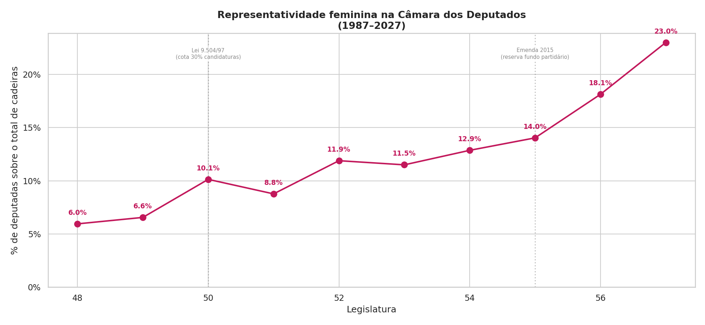
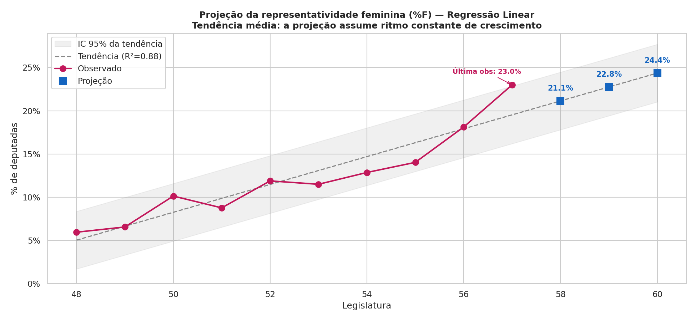

# Análise de Gênero na Câmara dos Deputados (1987–2027)

Este projeto utiliza **Ciência de Dados** e **Estatística Aplicada** para investigar a evolução da representatividade feminina no legislativo federal brasileiro. O objetivo é analisar se o gênero é um fator determinante para a permanência no poder e qual o ritmo esperado de crescimento para as próximas décadas.

---

## 1. Contexto Histórico
A participação feminina na política brasileira é marcada por uma sub-representação histórica. Mecanismos legais, como a **Lei de Cotas (1997)** e a **Reserva de Fundo Partidário (2015)**, atuaram como motores fundamentais de mudança.

* **O que o dado diz:** Saímos de **6.0%** na legislatura 48 para **23.0%** na atual. Cada ponto no gráfico representa uma quebra de barreira. Os maiores saltos coincidem com mudanças na legislação, provando que políticas afirmativas são essenciais para acelerar a história.

---

## 2. Questões relativas à permanência de cargo
O estudo investiga se as mulheres, uma vez eleitas, mantêm seus cargos na mesma proporção que os homens, utilizando uma *proxy* de reeleição (presença em legislaturas consecutivas).

.png)

* **Interpretação:** As linhas de homens (azul) e mulheres (rosa) cruzam-se frequentemente. Quando as faixas sombreadas (Intervalos de Confiança) se sobrepõem, não há diferença estatística significativa. Portanto, indica que **o desafio real não é a permanência, mas sim a barreira de acesso inicial ao cargo**.

Além disso, OR próximo de 1.0 indica que ser homem ou mulher não altera drasticamente a chance de continuidade e o fator "Legislatura" apresenta p-valor significativo, mostrando que a renovação política segue um processo temporal natural, independentemente do gênero de quem ocupa a cadeira.

---

## 4. Projeção Linear e Paridade de Gênero
Utilizei um modelo de **Regressão Linear** para projetar a tendência das próximas três legislaturas.

* **Previsão:** Estimamos atingir **24.4% em 2031**. Embora o crescimento seja constante ($R^2=0.88$), ainda estamos longe da paridade de 50%. No ritmo atual, a igualdade plena levaria décadas. Este dado é um convite à ação: como podemos acelerar essa curva?

---

## Metodologia 

O projeto foi desenvolvido em **Python**, seguindo rigorosos critérios estatísticos:

* **Processamento de Dados:** `Pandas` e `NumPy` para manipulação de dados em formato *long*.
* **Estatística Avançada:** `Statsmodels` para regressão logística e cálculos de *Intervalo de Confiança de Wilson* (robusto para amostras menores).
* **Machine Learning:** `Scikit-learn` para modelagem de tendências lineares.
* **Visualização:** `Matplotlib` e `Seaborn` com paletas de cores focadas em acessibilidade e contraste.

> **Nota Metodológica:** A "reeleição" é tratada como uma *proxy* baseada na presença consecutiva entre legislaturas (L-1 e L), capturando a continuidade do mandato parlamentar.

---

## Estrutura do Repositório

* `data/processed/`: Gráficos gerados e tabelas KPI.
* `notebook_analise.ipynb`: Código completo documentado.
* `requirements.txt`: Dependências para execução do ambiente.
* `deputados.csv`: Base de dados original (dados abertos).
