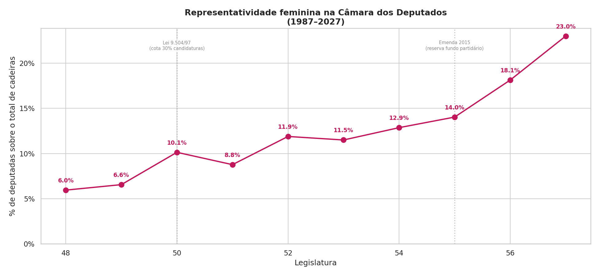
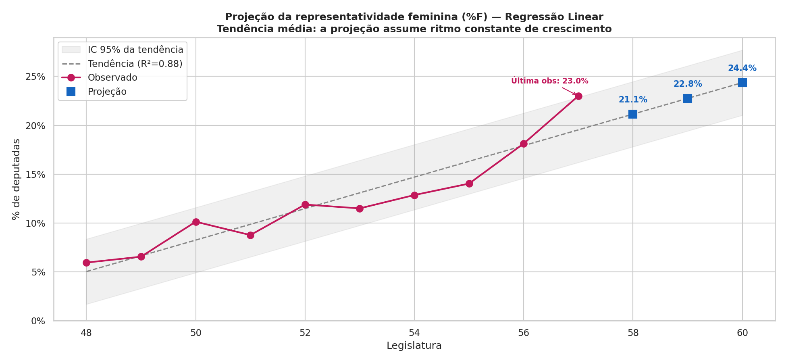

# Gender in the Brazilian Chamber of Deputies (1987–2027)

*English version. A versão em português está em [README.pt-BR.md](README.pt-BR.md).*

This project applies **data science** and **applied statistics** to the evolution of women's representation in Brazil's federal lower house. It asks whether gender is a determining factor for staying in office and what growth pace can be expected over the coming decades.

---

## Before the analysis

Starting from the Chamber of Deputies' open "Deputados" dataset, the variables to be used were selected and the fields that were not standardized were identified. From there the dataset was cleaned and the figures were post-stratified.

*Methodology*

The project was developed in **Python**, following these statistical criteria:

* **Data processing:** `pandas` and `NumPy` to reshape the data into *long* format (one row per deputy per legislature).
* **Statistics:** `statsmodels` for logistic regression and *Wilson confidence intervals* (robust for smaller samples).
* **Machine learning:** `scikit-learn` for linear trend modeling.
* **Visualization:** `matplotlib` and `seaborn` with color palettes chosen for accessibility and contrast.

> **Methodological note:** "re-election" is treated as a *proxy* based on consecutive presence across legislatures (L-1 and L), capturing the continuity of the parliamentary mandate.

## 1. Historical Context
Women's participation in Brazilian politics is marked by historical under-representation. Legal mechanisms such as the **Quota Law (1997)** and the **earmarked party fund (2015)** acted as key drivers of change.



* **What the data says:** the share of women went from **6.0%** in the 48th legislature to **23.0%** in the current one. Each point on the chart is a barrier broken. The largest jumps coincide with changes in legislation, showing that affirmative policies are essential to speed up the process.

---

## 2. Staying in Office
The study investigates whether women, once elected, keep their seats at the same rate as men, using the re-election proxy (presence in consecutive legislatures).

.png)

* **Reading:** the lines for men (blue) and women (pink) cross frequently. Where the shaded bands (confidence intervals) overlap, there is no statistically significant difference. The real challenge is therefore **not staying in office but the initial barrier to entry**.

In the logistic regression, an odds ratio close to 1.0 indicates that being a man or a woman does not materially change the odds of continuity, while the "legislature" factor has a significant p-value, showing that political turnover follows a natural temporal process.

---

## 3. Linear Projection and Gender Parity
A **linear regression** model was used to project the trend over the next three legislatures.



* **Forecast:** the estimate reaches **24.4% in 2031**. Although growth is steady ($R^2=0.88$), parity at 50% is still far away. At the current pace, full equality would take decades. The figure is an invitation to act: how can this curve be accelerated?

---

## Repository Layout

* `data/portfolio_genero_deputados_Version8.py`: full documented pipeline (cleaning, long format, re-election proxy, KPIs with Wilson intervals, logistic regression with odds ratios, linear projection and charts).
* `data/deputados.csv`: original dataset from the Chamber of Deputies open data portal. Identifying fields that are not needed (such as `cpf` and social media URLs) are dropped in the first cleaning step.
* `data/processed/`: generated charts and KPI tables.

## How to Run

```bash
pip install pandas numpy matplotlib seaborn statsmodels scikit-learn
cd data
python portfolio_genero_deputados_Version8.py
```

The script reads `deputados.csv` from the working directory and writes the cleaned long table, the KPI table and the charts to a `data/processed/` folder created next to it.
